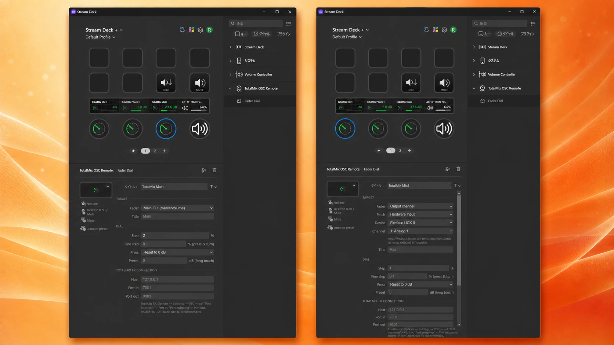

# TotalMix OSC Remote for Stream Deck

Control **RME TotalMix FX** from your **Elgato Stream Deck** via OSC — with true Float32 faders, mute and dim.

[](https://github.com/rimtty/TotalMix-OSC-Remote/actions/workflows/ci.yml)



Generic OSC plugins often send integer values — which TotalMix FX silently ignores, because its fader endpoints expect **Float32 (0.0–1.0)**. This plugin is purpose-built for TotalMix FX: correct value types, bidirectional feedback, and channel lists read live from your mixer.

## Features

- **Fader Dial** (Stream Deck + encoders)
  - Rotate to control any TotalMix fader with Float32 precision; press & turn for fine adjustment
  - Push = reset to 0 dB or mute (configurable), touch = mute, long-touch = jump to a preset level
  - Touch strip shows the channel name, the **dB value reported back by TotalMix**, and a level bar
- **Mute key** — 2-state toggle that follows TotalMix feedback in both directions (change it in TotalMix and the key updates too)
- **Fader Dim key** — remembers the current fader value, attenuates by a set amount (default **-20 dB ≈ "10% volume"**) or a factor, and restores it on the next press. If the fader is moved elsewhere while dimmed, the stored value is discarded for safety
- **Any mixer row (patch)** — target Hardware Inputs, Software Playback or Hardware Outputs, plus the Control Room **Main Out**
- **Live channel names** — the channel picker is built from TotalMix `trackname` feedback, so mono-split or renamed channels always get the correct strip numbers. Falls back to built-in maps for Fireface UCX II / UCX / Babyface Pro (FS)
- **TotalMix color language** — green for levels, blue for mute, orange for dim

## Requirements

| | |
|---|---|
| OS | Windows 10+ / macOS 12+ |
| Stream Deck app | 7.1 or later (dials require Stream Deck +; keys work on any Stream Deck) |
| Audio interface | RME interface running TotalMix FX (developed and tested with Fireface UCX II) |

## Installation

Download the latest `com.rimtty.totalmix-osc-remote.streamDeckPlugin` from the [Releases page](https://github.com/rimtty/TotalMix-OSC-Remote/releases/latest) and double-click it — the Stream Deck app installs it.

<details>
<summary>Building from source (for development)</summary>

```bash
git clone https://github.com/rimtty/TotalMix-OSC-Remote.git
cd TotalMix-OSC-Remote
npm install
npm run build && npm run images
npx @elgato/cli dev
npx @elgato/cli link com.rimtty.totalmix-osc-remote.sdPlugin
```

A `.streamDeckPlugin` file is also produced by CI for every commit (see the Actions artifacts).

</details>

## TotalMix FX setup

1. **Options → Enable MIDI/OSC Control** — turn it on
2. **Options → Settings → OSC** tab — pick a Remote Controller slot (1–4) and set:

| Setting | Value |
|---|---|
| In Use | ✔ |
| Port incoming | `7001` (= plugin "Port in") |
| Port outgoing | `9001` (= plugin "Port out") |
| IP or Host Name | address of the machine running Stream Deck (`127.0.0.1` if same PC) |
| Number of faders per bank | **16 recommended** (must cover all strips of a row) |

The connection settings live in each action's inspector under *TotalMix FX Connection* and are shared by all actions.

## Notes & limitations

- TotalMix's classic OSC protocol is *bank/bus-relative*. The plugin pins the bank to the start and switches the mixer row automatically before each command — you don't have to think about it, but only one row is "active" per OSC controller slot at a time.
- **Input / Playback faders are sends into the submix currently selected in TotalMix** (that is how the protocol models them).
- The Main Out has no dedicated OSC mute; the Main option of the Mute key toggles TotalMix **Dim** instead (set the dim amount in TotalMix).
- dB values shown on the touch strip come from TotalMix itself; the internal dB↔fader conversion uses the approximation from [totalmix-volume-control](https://github.com/fgimian/totalmix-volume-control) (MIT), validated against TotalMix readback.

## Development

```bash
npm test          # unit tests (OSC codec, fader taper, UDP loopback integration)
npx tsc --noEmit  # type check
npm run watch     # rebuild on change
npm run validate  # Elgato manifest/layout validation
```

Design documents (Japanese): [implementation plan](docs/PLAN.md) · [OSC endpoint reference for UCX II / UCX / Babyface Pro](docs/OSC-ENDPOINTS.md) · [icon design](docs/ICON-DESIGN.md)

CI runs type check, tests, build, `streamdeck validate` and packs a `.streamDeckPlugin` artifact on every push and pull request.

## License

[MIT](LICENSE) — not affiliated with RME or Elgato. TotalMix is a trademark of RME Audio, Stream Deck of Corsair/Elgato.

---

# 日本語

RME **TotalMix FX** を Elgato **Stream Deck** から OSC で操作するプラグインです。汎用 OSC プラグインは Int 値を送りがちですが、TotalMix のフェーダーは **Float32(0.0–1.0)以外を無視**します。本プラグインは TotalMix FX 専用設計で、正しい型・双方向フィードバック・実機からのチャンネル名取得に対応しています。

## 主な機能

- **Fader Dial**(Stream Deck + のダイヤル): 回転で音量、押しながら回転で微調整、押下で 0 dB リセット/Mute、タッチで Mute、ロングタッチでプリセットへジャンプ。タッチストリップに **TotalMix が返す dB 値**とレベルバーを表示
- **Mute キー**: TotalMix と双方向同期する 2 状態トグル
- **Fader Dim キー**: 現在値を記憶して **-20 dB(≒音量10%)** などに減衰、再押下で復元。Dim 中に外部で値が動いたら記憶値を破棄(爆音事故防止)
- **パッチ段の指定**: Hardware Inputs / Software Playback / Hardware Outputs の任意の行+Main Out
- **チャンネル名のライブ取得**: モノ分割やリネームをしていても正しい番号・名前で選択可能(UCX II / UCX / Babyface Pro の内蔵定義にフォールバック)

## インストール

[Releases ページ](https://github.com/rimtty/TotalMix-OSC-Remote/releases/latest)から `com.rimtty.totalmix-osc-remote.streamDeckPlugin` をダウンロードしてダブルクリックするだけでインストールできます。

## セットアップ

TotalMix FX 側: **Options → Enable MIDI/OSC Control** を有効化し、**Options → Settings → OSC** で Remote Controller(1–4 のいずれか)に In Use / Port incoming `7001` / Port outgoing `9001` / IP(同一 PC なら `127.0.0.1`)/ **バンクあたりフェーダー数 16 推奨** を設定してください。プラグイン側の接続設定は各アクションの設定画面(全アクション共有)にあります。

## 既知の仕様

- Input / Playback のフェーダーは「TotalMix で現在選択中のサブミックスへのセンド」を操作します(クラシック OSC プロトコルの仕様)
- Main Out に専用の OSC Mute は無いため、Mute キーの Main オプションは TotalMix の **Dim** をトグルします
